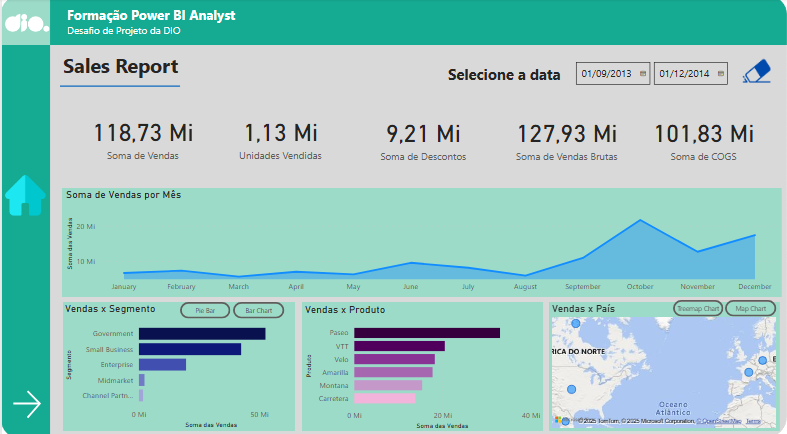
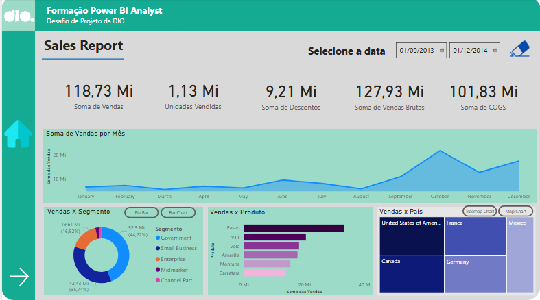
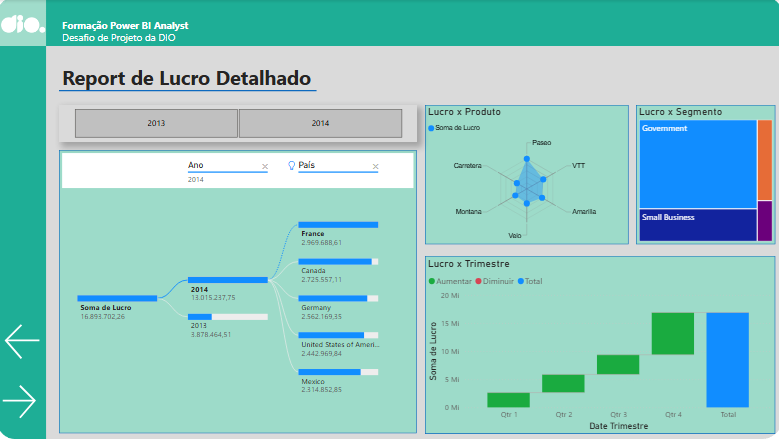
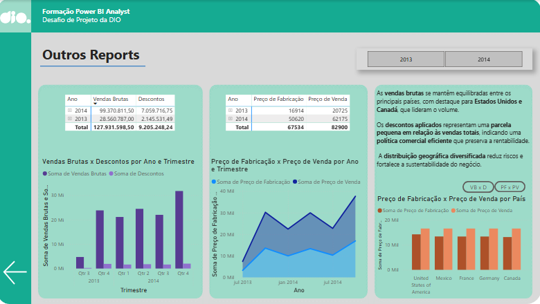

# 📊 Desafio Power BI Analyst - DIO  

Projeto desenvolvido como parte da **Formação Power BI Analyst** da [DIO](https://www.dio.me/).  
O desafio consistiu em criar e publicar um relatório mais elaborado no Power BI utilizando a base de dados **Sample Financials**.  

## 🚀 Objetivo do Desafio  
- Reproduzir e/ou melhorar o relatório modelo apresentado durante o curso.  
- Criar páginas adicionais aplicando os conceitos de:  
  - Estrutura definida  
  - Navegabilidade com botões  
  - Segmentadores e filtros  
  - Indicadores e alternância de visuais  
  - Layout organizado e visual agradável  

## 🛠️ O que foi desenvolvido  
- **Sales Report**: feito em aula junto com a professora.  
- **Dashboard Lucro Detalhado**: desenvolvido por mim como parte principal do desafio.  
- **Capa**: página inicial personalizada com botão de navegação.  
- **Outros Reports**: incremento ao projeto, trazendo novas análises.  

## 🧩 Funcionalidades  
Foram colocados botões responsáveis por:  
- 🔄 Navegação entre páginas (avançar, voltar, home);  
- 📅 Filtro e segmentação de datas;  
- 📊 Troca de visuais (ex.: gráfico de barras ↔ gráfico de pizza, mapa ↔ treemap).  
- 📌 Seleção de anos (2013 / 2014).  

## 📷 Screenshots do Relatório  
### 📌 Página Inicial (Capa)  
  

### 📊 Sales Report  
 

### 📊 Sales Report 2  
 

### 💰 Lucro Detalhado  
  

### 📑 Outros Reports  

### 📑 Apresentação em GIF  
  

---

## 🔗 Links Importantes  
- 📂 [Repositório de dados base (Sample Financials)](https://github.com/julianazanelatto/power_bi_analyst)  
- 🌐 [Publicação no Power BI Service](https://app.powerbi.com/groups/me/reports/ac62e3b1-1227-4a76-9ba7-3243dedac1a2/32706c890d8798960781?experience=power-bi) 
- 🌐 [Repositório do desafio](https://github.com/denisero19/dio_desafio_relatorio_vendas_power_bi) 

## 📚 Aprendizados  
Este desafio foi essencial para praticar:  
- Criação de dashboards interativos no Power BI.  
- Uso de segmentadores e botões para melhorar a experiência do usuário.  
- Estruturação de relatórios empresariais com foco em **vendas e lucro**.  

---

👨‍💻 Desenvolvido por *[Denise Rodrigues]* durante a Formação Power BI Analyst da [DIO](https://www.dio.me/).  
